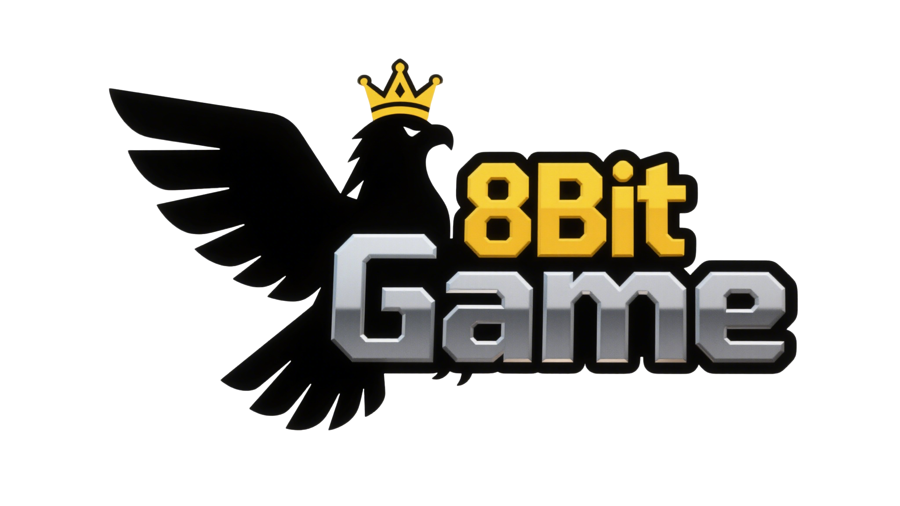

# 8Bit Game Web3



[Official Website](https://www.8bitgame.buzz/) | [Twitter](https://x.com/8BitGame8Bit)

---

## Introduction

**8Bit Game** is a next-generation Web3 retro gaming platform that revives the golden era of Nintendo FC/NES classics and fuses it with blockchain innovation. Play, earn, and own in a decentralized, community-driven metaverse inspired by the pixelated charm of the 80s and 90s. Powered by a high-performance WebAssembly NES emulator and integrated with the Solana blockchain, 8Bit Game delivers authentic gameplay, NFT collectibles, and Play-to-Earn (P2E) rewards.

---

## Key Features

- **80+ Classic NES Games**: Enjoy a curated library of legendary titles like Super Mario Bros., Contra, Battle City, and more.
- **Web3 Integration**: Connect your Solana wallet, earn Game tokens, and trade pixel-art NFTs.
- **Play in Browser**: No downloads required. Experience seamless emulation and retro visuals directly in your browser.
- **P2E Rewards**: Complete challenges, top leaderboards, and earn tokens and NFTs.
- **DAO Governance**: Community-driven game selection, feature voting, and ecosystem growth.
- **Cross-Device Support**: Play on desktop, mobile, or tablet with responsive controls.

---

## Project Architecture

- **Frontend**: Next.js + React + Tailwind CSS for a modern, responsive UI.
- **Emulator**: WebAssembly-accelerated NES emulator (jsnes) for high-fidelity gameplay.
- **Blockchain**: Solana smart contracts (Anchor framework) for token rewards, NFT minting, and DAO voting.
- **Storage**: Game ROMs and cloud saves via IPFS and CDN for low-latency access.
- **Backend**: Optional Node.js microservices for leaderboard, analytics, and event management.

---

## How It Works

1. **Connect Wallet**: Use Phantom or Solflare to log in securely.
2. **Browse Games**: Select from a growing library of NES classics.
3. **Play Instantly**: Launch games in your browser with pixel-perfect emulation.
4. **Earn Rewards**: Complete in-game achievements and challenges to earn Game tokens and NFTs.
5. **Trade & Govern**: Use tokens to participate in DAO votes, trade NFTs, and unlock exclusive content.

---

## Quick Start

### Prerequisites
- Node.js 16+
- npm or yarn
- Solana wallet (Phantom recommended)

### Installation
```bash
git clone https://github.com/8BitGame-web3/8bitGameWeb3.git
cd 8bit-game-web3
npm install
```

### Environment Setup
Create a `.env.local` file in the root directory:
```
NEXT_PUBLIC_SOLANA_RPC_URL=https://api.devnet.solana.com
NEXT_PUBLIC_GAME_TOKEN_MINT=your_token_mint_address
```

### Run Locally
```bash
npm run dev
```
Visit [http://localhost:3000](http://localhost:3000) in your browser.

### Docker Support
```bash
docker-compose up
```

---

## Running Logic

- **Game Selection**: Users select a game from the library UI. The emulator loads the corresponding ROM from IPFS/CDN.
- **Wallet Connection**: The app uses Solana Wallet Adapter for secure authentication and transaction signing.
- **Gameplay & Achievements**: Emulator tracks in-game events (score, level, achievements). When a challenge is completed, a transaction is triggered to reward the player with Game tokens or NFTs.
- **P2E Rewards**: Smart contracts distribute tokens based on on-chain achievement verification.
- **NFT Minting**: Players can mint pixel-art NFTs for achievements, skins, or custom content.
- **DAO Voting**: Token holders propose and vote on new games, features, and community events.

---

## Project Structure

```
8bit-game-web3/
├── public/            # Static assets (including Logo.jpg, game images, ROMs)
├── src/
│   ├── components/    # React UI components
│   ├── pages/         # Next.js pages
│   ├── contracts/     # Solana smart contract interfaces
│   ├── utils/         # Utility functions (achievements, wallet, etc.)
│   └── styles/        # Tailwind CSS and custom styles
├── solana/program/    # Rust smart contract source (Anchor)
├── .env.local         # Environment variables
├── Dockerfile         # Docker build config
├── docker-compose.yml # Docker Compose config
├── README.md          # Project documentation
└── ...
```

---

## Useful Links

- **Official Website**: [https://www.8bitgame.buzz/](https://www.8bitgame.buzz/)
- **Twitter**: [https://x.com/8BitGame8Bit](https://x.com/8BitGame8Bit)
- **Game Library**: [Browse Games](https://www.8bitgame.buzz/#games)

---

## Contributing

1. Fork the repository
2. Create your feature branch (`git checkout -b feature/your-feature`)
3. Commit your changes (`git commit -m 'Add new feature'`)
4. Push to the branch (`git push origin feature/your-feature`)
5. Open a Pull Request

---

## License

This project is licensed under the MIT License. See the [LICENSE](LICENSE) file for details.

---

## Acknowledgments

- Nintendo, jsnes, Solana, Next.js, and the open-source community for inspiration and technology.
- All retro gamers and Web3 pioneers for shaping the future of gaming! 
